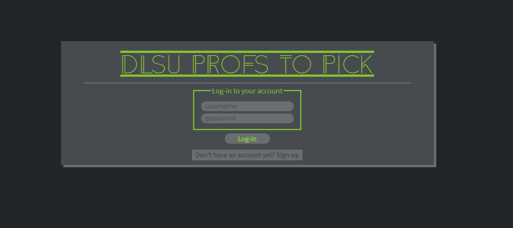
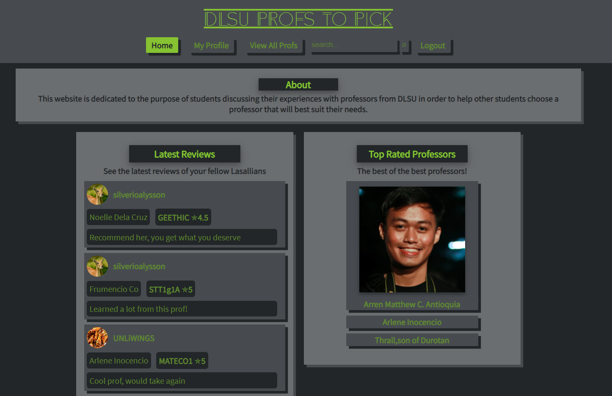
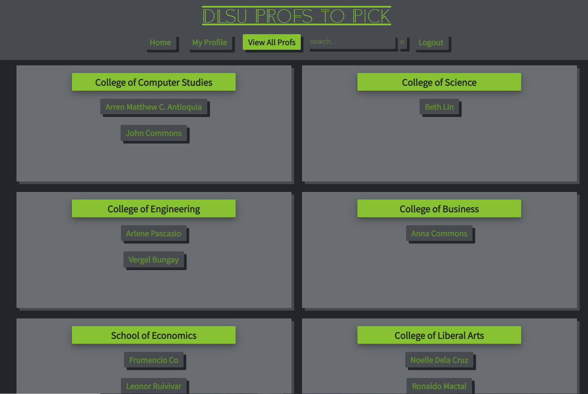

# DLSU Profs To Pick
This web application is dedicated to the purpose of students discussing their experiences with professors from DLSU in order to help other students choose a professor that will best suit their needs.

## Contents

Each folder and file in this repository is properly documented. You may read the `README.md` file of each folder to understand its content. You may also read the inline comments of each file explaining the statements line-per-line.

- [controllers](https://github.com/ccapdev1920T2/s12g11/tree/master/controllers) - This folder contains files which defines callback functions for client requests.
- [models](https://github.com/ccapdev1920T2/s12g11/tree/master/models) - This folder contains files for database modeling and access.
- [public](https://github.com/ccapdev1920T2/s12g11/tree/master/public) - This folder contains static assets such as css, js, and image files.
- [routes](https://github.com/ccapdev1920T2/s12g11/tree/master/routes) - This folder contains files which describes the response of the server for each HTTP method request to a specific path in the server.
- [views](https://github.com/ccapdev1920T2/s12g11/tree/master/views) - This folder contains all hbs files to be rendered when requested from the server.
- [index.js](https://github.com/ccapdev1920T2/s12g11/blob/master/index.js) - The main entry point of the web application.

## Installation

1. Clone the repository either by downloading the contents of the repository [here](https://github.com/ccapdev1920T2/s12g11), or using the command below (Note: git should be installed in your system for this to work).
```
git clone https://github.com/ccapdev1920T2/s12g11
```
2. Open Command Prompt
3. Navigate to the project folder - the folder containing the contents of the cloned or downloaded repository.
4. Run the command `npm install` to initialize and install all necessary modules used in the project.

## Running the Application

1. Run the command `node add_data.js` in order to add the dummy data into the database.
2. We may now run our server. To do this, we run the command `node index.js`. Upon running the command, your Command Prompt should display the following statement:
```
app listening at port 3000
Connected to: mongodb://localhost:27017/profsToPickDB
```
3. Let's test our web application. Go to the link below to access the web application:
```
http://localhost:3000/
```

You should now be seeing the Login page that looks like this:


4. To create an account, simply click the button that says "Don't have an account yet? Sign-up"

You should now be seeing a page that looks like this:


>Note that this web application maintains unique accounts through unique usernames, entering a username that has already been registered will flag an error!

5. Now let's go back to the Login page by clicking the button that says "Already have an account? Log-in". You may Log-in using an account that you have created or you could use the following dummy acounts:

```
username: Jeddy the gouf
password: asd

username: Ygg
password: asd
```

After clicking the "Log-in" button, you would be redirected to the profile of the account that should look something like this:


6. Let's first explore Home, click the "Home" button located in the navigation bar. 

Here, you would see a simple description of the web application, the Latest Reviews made by the users and the Top Rated Professors



7. Next, let's look for a professor's profile. There are a number of ways to do this, let's discuss them one by one!


> First is by Navigating through the "View All Profs" which can be found in the navigation bar.

Here, we'll see all the professors currently in the database, they are sorted by the college where they belong to


> Second is by searching in the search bar found in the navigation bar and clicking the magnifying glass button.

As an example, try to search for the keyword "Commons" and you should see a page like this:

Note that the keyword that you entered is matched with the professors' Name, College and Department, and is case sensitive!

> Lastly, users may simply click the name of the professors in review entries or Top Rated Professors found in "Home" and "My Profile" page that we have seen earlier or in any page in the web application where review entries can be seen!

8. Let's now pick any professor and look at their profile!

Here we see a professor's profile page, this is where users can see the professors' details, reviews, ratings and subjects

On the top of the review entries is where the users can input their reviews, simply enter the body of the review, the course code and the rating.

> Note that users may only create one review to a specific course, creating a second review with the same course will flag an error!

9. Now let's go back to our profile page by clicking in the navigation bar the button "My Profile"

In the profile page we see the details of the user as well as the user's reviews. This is also where a user can delete or edit his/her reviews!


> Note that there will be prompts before a Delete or an Edit is completed.

Here is what it looks like when editing a review:


> Note that when editing, the user is allowed to change the body, course code and rating of the review but keep in mind that the professor being reviewed remains as is!

10. Now of course we are also curious of other users and we would also want to view their profiles and reviews. There are also a number of ways to do this.

> We can type in the address bar "http://localhost:3000/user/" and append their username, for example we can type:
```
http://localhost:3000/user/Jeddy the gouf
```

> We may also find a review entry, either at "Home" or in a professor's profile page and click the user's username. 

As we can see below, when viewing another user's profile, we would not have the authority to delete or edit their reviews.: 


11. We can now Log out by clicking the "Logout" button in the navigatio bar.

We'll see a page that looks like this:

Simply click the button "Click here to log back in" to return to the Login page

## Final Notes

> This web application is built such that the user will be redirected to an error page if the user tries to access the pages aside from Login and Signup pages without logging in first.

> Creating a new account assigns a gorgeous default profile picture.

## Authors

>From CCAPDEV S12 Group 11:
```
SILVERIO, Gwyneth Patricia Alysson
TAN, Jedwig Siegfrid
TAN, Salvador Jr.
```